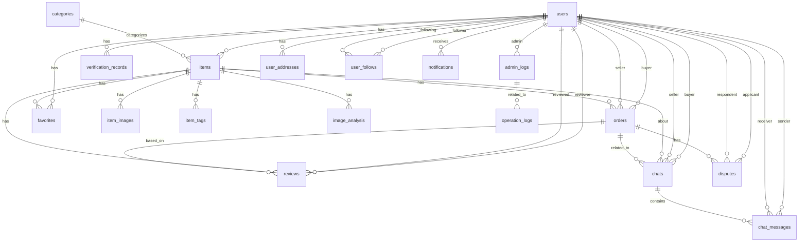

# 数据库设计文档

## 一、设计概述

### 1. 设计目标

- **功能完整性**：满足平台所有业务功能的需求
- **数据一致性**：确保数据的准确性和完整性
- **性能优化**：合理设计索引和表结构，提高查询效率
- **可扩展性**：支持未来功能的扩展和数据量的增长
- **安全性**：保护敏感数据，防止数据泄露

### 2. 设计原则

- **范式遵循**：遵循第三范式，减少数据冗余
- **命名规范**：表名和字段名使用小写字母，单词间用下划线分隔
- **数据类型**：根据数据特性选择合适的数据类型
- **索引策略**：为常用查询字段建立索引
- **约束机制**：使用适当的约束确保数据完整性

## 二、表结构设计

### 1. users 表

**表结构**：

| 字段名 | 数据类型 | 是否为空 | 默认值 | 用途说明 |
|--------|----------|----------|--------|----------|
| id | BIGINT | NOT NULL | AUTO_INCREMENT | 主键 |
| username | VARCHAR(50) | NOT NULL | - | 用户名 |
| password | VARCHAR(100) | NOT NULL | - | 密码（BCrypt加密） |
| email | VARCHAR(100) | NOT NULL | - | 邮箱 |
| phone | VARCHAR(20) | NOT NULL | - | 手机号 |
| nickname | VARCHAR(50) | NOT NULL | - | 昵称 |
| avatar | VARCHAR(255) | NULL | - | 头像URL |
| role | TINYINT | NOT NULL | 0 | 角色（0-游客，1-学生，2-管理员，3-超级管理员） |
| status | TINYINT | NOT NULL | 1 | 状态（0-禁用，1-启用） |
| verified | TINYINT | NOT NULL | 0 | 是否实名认证 |
| student_id | VARCHAR(20) | NULL | - | 学号 |
| is_deleted | TINYINT(1) | NOT NULL | 0 | 逻辑删除标识 |
| create_by | BIGINT | NULL | - | 创建人ID |
| update_by | BIGINT | NULL | - | 更新人ID |
| last_login_time | DATETIME | NULL | - | 最后登录时间 |
| last_login_ip | VARCHAR(50) | NULL | - | 最后登录IP |
| login_count | INT | NOT NULL | 0 | 登录次数统计 |
| gender | TINYINT | NULL | - | 性别（0-未知，1-男，2-女） |
| birthday | DATE | NULL | - | 生日 |
| bio | VARCHAR(500) | NULL | - | 个人简介 |
| school_name | VARCHAR(100) | NULL | - | 学校名称 |
| credit_score | INT | NOT NULL | 100 | 信用评分（0-100） |
| total_transactions | INT | NOT NULL | 0 | 累计交易次数 |
| total_sales | INT | NOT NULL | 0 | 累计售出商品数 |
| total_purchases | INT | NOT NULL | 0 | 累计购买商品数 |
| created_at | DATETIME | NOT NULL | CURRENT_TIMESTAMP | 创建时间 |
| updated_at | DATETIME | NULL | - | 更新时间 |

**索引**：
- PRIMARY KEY (id)
- UNIQUE INDEX (username)
- UNIQUE INDEX (email)
- UNIQUE INDEX (phone)
- INDEX (role, status, verified)
- INDEX (last_login_time)
- INDEX (credit_score)

### 2. items 表

**表结构**：

| 字段名 | 数据类型 | 是否为空 | 默认值 | 用途说明 |
|--------|----------|----------|--------|----------|
| id | BIGINT | NOT NULL | AUTO_INCREMENT | 主键 |
| user_id | BIGINT | NOT NULL | - | 用户ID |
| category_id | BIGINT | NOT NULL | - | 分类ID |
| title | VARCHAR(100) | NOT NULL | - | 标题 |
| description | TEXT | NOT NULL | - | 描述 |
| price | DECIMAL(10,2) | NOT NULL | 0.00 | 价格 |
| original_price | DECIMAL(10,2) | NULL | - | 原价 |
| condition | TINYINT | NOT NULL | 1 | 成色（1-全新，2-九成新，3-八成新，4-七成新，5-六成新及以下） |
| status | TINYINT | NOT NULL | 1 | 状态（1-在售，2-已售出，3-已下架，4-审核中，5-审核失败） |
| view_count | INT | NOT NULL | 0 | 浏览次数 |
| favorite_count | INT | NOT NULL | 0 | 收藏次数 |
| reject_reason | VARCHAR(500) | NULL | - | 审核失败原因 |
| location | VARCHAR(100) | NOT NULL | - | 位置 |
| is_deleted | TINYINT(1) | NOT NULL | 0 | 逻辑删除标识 |
| create_by | BIGINT | NULL | - | 创建人ID |
| update_by | BIGINT | NULL | - | 更新人ID |
| publish_time | DATETIME | NULL | - | 发布时间 |
| off_shelf_time | DATETIME | NULL | - | 下架时间 |
| sold_time | DATETIME | NULL | - | 售出时间 |
| quality_score | DECIMAL(3,2) | NULL | - | 商品质量评分（AI识别） |
| is_bargain_allowed | TINYINT(1) | NOT NULL | 1 | 是否允许议价 |
| min_price | DECIMAL(10,2) | NULL | - | 最低接受价格 |
| contact_type | TINYINT | NOT NULL | 1 | 联系方式（1-平台内，2-微信，3-QQ） |
| contact_info | VARCHAR(100) | NULL | - | 联系信息 |
| is_recommended | TINYINT(1) | NOT NULL | 0 | 是否推荐商品 |
| recommend_time | DATETIME | NULL | - | 推荐时间 |
| weight | INT | NOT NULL | 0 | 商品重量（克） |
| delivery_method | TINYINT | NOT NULL | 1 | 配送方式（1-自提，2-快递，3-两者皆可） |
| tags | VARCHAR(500) | NULL | - | 商品标签（JSON格式） |
| brand | VARCHAR(100) | NULL | - | 品牌 |
| purchase_date | DATE | NULL | - | 购买日期 |
| warranty_info | VARCHAR(255) | NULL | - | 保修信息 |
| created_at | DATETIME | NOT NULL | CURRENT_TIMESTAMP | 创建时间 |
| updated_at | DATETIME | NULL | - | 更新时间 |

**索引**：
- PRIMARY KEY (id)
- INDEX (user_id)
- INDEX (category_id)
- INDEX (status, price)
- INDEX (publish_time)
- INDEX (is_recommended, recommend_time)
- INDEX (view_count, favorite_count)

### 3. orders 表

**表结构**：

| 字段名 | 数据类型 | 是否为空 | 默认值 | 用途说明 |
|--------|----------|----------|--------|----------|
| id | BIGINT | NOT NULL | AUTO_INCREMENT | 主键 |
| order_no | VARCHAR(50) | NOT NULL | - | 订单号 |
| buyer_id | BIGINT | NOT NULL | - | 买家ID |
| seller_id | BIGINT | NOT NULL | - | 卖家ID |
| item_id | BIGINT | NOT NULL | - | 商品ID |
| item_title | VARCHAR(100) | NOT NULL | - | 商品标题 |
| item_image | VARCHAR(255) | NOT NULL | - | 商品图片 |
| price | DECIMAL(10,2) | NOT NULL | 0.00 | 商品价格 |
| order_status | TINYINT | NOT NULL | 0 | 订单状态（0-待支付，1-待发货，2-待收货，3-已完成，4-已取消，5-退款中，6-已退款） |
| buyer_address | VARCHAR(200) | NULL | - | 买家地址 |
| buyer_phone | VARCHAR(20) | NULL | - | 买家电话 |
| buyer_name | VARCHAR(50) | NULL | - | 买家姓名 |
| payment_method | TINYINT | NULL | - | 支付方式（1-微信，2-支付宝） |
| payment_time | DATETIME | NULL | - | 支付时间 |
| ship_time | DATETIME | NULL | - | 发货时间 |
| deliver_time | DATETIME | NULL | - | 收货时间 |
| complete_time | DATETIME | NULL | - | 完成时间 |
| cancel_reason | VARCHAR(500) | NULL | - | 取消原因 |
| refund_reason | VARCHAR(500) | NULL | - | 退款原因 |
| refund_time | DATETIME | NULL | - | 退款时间 |
| refund_amount | DECIMAL(10,2) | NULL | - | 退款金额 |
| is_deleted | TINYINT(1) | NOT NULL | 0 | 逻辑删除标识 |
| create_by | BIGINT | NULL | - | 创建人ID |
| update_by | BIGINT | NULL | - | 更新人ID |
| total_amount | DECIMAL(10,2) | NOT NULL | 0.00 | 订单总金额 |
| shipping_fee | DECIMAL(10,2) | NOT NULL | 0.00 | 运费 |
| discount_amount | DECIMAL(10,2) | NOT NULL | 0.00 | 优惠金额 |
| pay_amount | DECIMAL(10,2) | NOT NULL | 0.00 | 实际支付金额 |
| transaction_id | VARCHAR(100) | NULL | - | 第三方支付交易号 |
| payment_status | TINYINT | NOT NULL | 0 | 支付状态（0-未支付，1-已支付，2-支付失败） |
| shipping_status | TINYINT | NOT NULL | 0 | 物流状态（0-未发货，1-已发货，2-已收货） |
| tracking_no | VARCHAR(50) | NULL | - | 物流单号 |
| shipping_company | VARCHAR(50) | NULL | - | 物流公司 |
| seller_note | VARCHAR(500) | NULL | - | 卖家备注 |
| buyer_note | VARCHAR(500) | NULL | - | 买家备注 |
| auto_confirm_time | DATETIME | NULL | - | 自动确认收货时间 |
| close_time | DATETIME | NULL | - | 订单关闭时间 |
| close_type | TINYINT | NULL | - | 关闭类型（1-超时未支付，2-买家取消，3-卖家取消） |
| source | TINYINT | NOT NULL | 1 | 订单来源（1-直接购买，2-议价成交） |
| ip_address | VARCHAR(50) | NULL | - | 下单IP地址 |
| user_agent | VARCHAR(500) | NULL | - | 用户代理信息 |
| created_at | DATETIME | NOT NULL | CURRENT_TIMESTAMP | 创建时间 |
| updated_at | DATETIME | NULL | - | 更新时间 |

**索引**：
- PRIMARY KEY (id)
- UNIQUE INDEX (order_no)
- INDEX (buyer_id, order_status)
- INDEX (seller_id, order_status)
- INDEX (item_id)
- INDEX (payment_time)
- INDEX (ship_time)
- INDEX (deliver_time)

### 4. categories 表

**表结构**：

| 字段名 | 数据类型 | 是否为空 | 默认值 | 用途说明 |
|--------|----------|----------|--------|----------|
| id | BIGINT | NOT NULL | AUTO_INCREMENT | 主键 |
| name | VARCHAR(50) | NOT NULL | - | 分类名称 |
| description | VARCHAR(500) | NULL | - | 分类描述 |
| parent_id | BIGINT | NULL | - | 父分类ID |
| sort_order | INT | NOT NULL | 0 | 排序顺序 |
| icon | VARCHAR(255) | NULL | - | 分类图标 |
| is_deleted | TINYINT(1) | NOT NULL | 0 | 逻辑删除标识 |
| create_by | BIGINT | NULL | - | 创建人ID |
| update_by | BIGINT | NULL | - | 更新人ID |
| level | TINYINT | NOT NULL | 1 | 分类层级（1-一级，2-二级，3-三级） |
| path | VARCHAR(500) | NULL | - | 分类路径（如：1/2/3） |
| is_show | TINYINT(1) | NOT NULL | 1 | 是否显示 |
| item_count | INT | NOT NULL | 0 | 该分类下的商品数量 |
| keywords | VARCHAR(255) | NULL | - | SEO关键词 |
| meta_description | VARCHAR(500) | NULL | - | SEO描述 |
| image | VARCHAR(255) | NULL | - | 分类图片 |
| background_color | VARCHAR(20) | NULL | - | 背景颜色 |
| created_at | DATETIME | NOT NULL | CURRENT_TIMESTAMP | 创建时间 |
| updated_at | DATETIME | NULL | - | 更新时间 |

**索引**：
- PRIMARY KEY (id)
- INDEX (parent_id)
- INDEX (level, sort_order)
- INDEX (is_show)

### 5. verification_records 表

**表结构**：

| 字段名 | 数据类型 | 是否为空 | 默认值 | 用途说明 |
|--------|----------|----------|--------|----------|
| id | BIGINT | NOT NULL | AUTO_INCREMENT | 主键 |
| user_id | BIGINT | NOT NULL | - | 用户ID |
| real_name | VARCHAR(50) | NOT NULL | - | 真实姓名 |
| student_id | VARCHAR(20) | NOT NULL | - | 学号 |
| id_card | VARCHAR(20) | NOT NULL | - | 身份证号 |
| student_card_image | VARCHAR(255) | NOT NULL | - | 学生证照片 |
| status | TINYINT | NOT NULL | 0 | 状态（0-待审核，1-审核通过，2-审核失败） |
| reject_reason | VARCHAR(500) | NULL | - | 拒绝原因 |
| reviewer_id | BIGINT | NULL | - | 审核人ID |
| reviewed_at | DATETIME | NULL | - | 审核时间 |
| is_deleted | TINYINT(1) | NOT NULL | 0 | 逻辑删除标识 |
| create_by | BIGINT | NULL | - | 创建人ID |
| update_by | BIGINT | NULL | - | 更新人ID |
| school_name | VARCHAR(100) | NULL | - | 学校名称 |
| department | VARCHAR(100) | NULL | - | 院系 |
| major | VARCHAR(100) | NULL | - | 专业 |
| enrollment_year | INT | NULL | - | 入学年份 |
| graduation_year | INT | NULL | - | 预计毕业年份 |
| student_card_back_image | VARCHAR(255) | NULL | - | 学生证背面照片 |
| id_card_front_image | VARCHAR(255) | NULL | - | 身份证正面照片 |
| id_card_back_image | VARCHAR(255) | NULL | - | 身份证背面照片 |
| face_recognition_image | VARCHAR(255) | NULL | - | 人脸识别照片 |
| face_recognition_passed | TINYINT(1) | NULL | - | 人脸识别是否通过 |
| submit_count | INT | NOT NULL | 1 | 提交次数 |
| last_submit_time | DATETIME | NULL | - | 最后提交时间 |
| review_remark | VARCHAR(500) | NULL | - | 审核备注 |
| auto_approved | TINYINT(1) | NOT NULL | 0 | 是否自动审核通过 |
| risk_level | TINYINT | NOT NULL | 0 | 风险等级（0-正常，1-低风险，2-中风险，3-高风险） |
| created_at | DATETIME | NOT NULL | CURRENT_TIMESTAMP | 创建时间 |
| updated_at | DATETIME | NULL | - | 更新时间 |

**索引**：
- PRIMARY KEY (id)
- INDEX (user_id, status)
- INDEX (status, reviewed_at)

### 6. reviews 表

**表结构**：

| 字段名 | 数据类型 | 是否为空 | 默认值 | 用途说明 |
|--------|----------|----------|--------|----------|
| id | BIGINT | NOT NULL | AUTO_INCREMENT | 主键 |
| order_id | BIGINT | NOT NULL | - | 订单ID |
| reviewer_id | BIGINT | NOT NULL | - | 评价人ID |
| reviewed_user_id | BIGINT | NOT NULL | - | 被评价人ID |
| item_id | BIGINT | NOT NULL | - | 商品ID |
| rating | TINYINT | NOT NULL | 5 | 评分（1-5分） |
| content | TEXT | NOT NULL | - | 评价内容 |
| images | VARCHAR(1000) | NULL | - | 评价图片（JSON格式） |
| is_anonymous | TINYINT(1) | NOT NULL | 0 | 是否匿名 |
| is_deleted | TINYINT(1) | NOT NULL | 0 | 逻辑删除标识 |
| create_by | BIGINT | NULL | - | 创建人ID |
| update_by | BIGINT | NULL | - | 更新人ID |
| reply_content | VARCHAR(1000) | NULL | - | 被评价者回复内容 |
| reply_time | DATETIME | NULL | - | 回复时间 |
| is_show | TINYINT(1) | NOT NULL | 1 | 是否显示 |
| helpful_count | INT | NOT NULL | 0 | 觉得有用的人数 |
| report_count | INT | NOT NULL | 0 | 被举报次数 |
| is_reported | TINYINT(1) | NOT NULL | 0 | 是否被举报 |
| report_reason | VARCHAR(255) | NULL | - | 举报原因 |
| check_status | TINYINT | NOT NULL | 0 | 审核状态（0-待审核，1-已通过，2-未通过） |
| check_time | DATETIME | NULL | - | 审核时间 |
| check_remark | VARCHAR(255) | NULL | - | 审核备注 |
| tag | VARCHAR(100) | NULL | - | 评价标签（JSON格式） |
| created_at | DATETIME | NOT NULL | CURRENT_TIMESTAMP | 创建时间 |
| updated_at | DATETIME | NULL | - | 更新时间 |

**索引**：
- PRIMARY KEY (id)
- INDEX (order_id)
- INDEX (reviewer_id, reviewed_user_id)
- INDEX (item_id, rating)
- INDEX (check_status, is_show)

### 7. favorites 表

**表结构**：

| 字段名 | 数据类型 | 是否为空 | 默认值 | 用途说明 |
|--------|----------|----------|--------|----------|
| id | BIGINT | NOT NULL | AUTO_INCREMENT | 主键 |
| user_id | BIGINT | NOT NULL | - | 用户ID |
| item_id | BIGINT | NOT NULL | - | 商品ID |
| is_deleted | TINYINT(1) | NOT NULL | 0 | 逻辑删除标识 |
| category_id | BIGINT | NULL | - | 商品分类ID |
| price_snapshot | DECIMAL(10,2) | NULL | - | 收藏时的价格快照 |
| remark | VARCHAR(255) | NULL | - | 用户备注 |
| notify_when_price_drop | TINYINT(1) | NOT NULL | 0 | 降价时是否通知 |
| target_price | DECIMAL(10,2) | NULL | - | 目标价格 |
| created_at | DATETIME | NOT NULL | CURRENT_TIMESTAMP | 创建时间 |

**索引**：
- PRIMARY KEY (id)
- UNIQUE INDEX (user_id, item_id) | 确保用户不会重复收藏同一商品 |
- INDEX (user_id, is_deleted)
- INDEX (item_id)

### 8. chats 表

**表结构**：

| 字段名 | 数据类型 | 是否为空 | 默认值 | 用途说明 |
|--------|----------|----------|--------|----------|
| id | BIGINT | NOT NULL | AUTO_INCREMENT | 主键 |
| order_id | BIGINT | NULL | - | 订单ID |
| item_id | BIGINT | NULL | - | 商品ID |
| buyer_id | BIGINT | NOT NULL | - | 买家ID |
| seller_id | BIGINT | NOT NULL | - | 卖家ID |
| is_deleted | TINYINT(1) | NOT NULL | 0 | 逻辑删除标识 |
| create_by | BIGINT | NULL | - | 创建人ID |
| update_by | BIGINT | NULL | - | 更新人ID |
| last_message_id | BIGINT | NULL | - | 最后一条消息ID |
| last_message_content | VARCHAR(500) | NULL | - | 最后一条消息内容预览 |
| last_message_time | DATETIME | NULL | - | 最后消息时间 |
| last_message_sender_id | BIGINT | NULL | - | 最后消息发送者ID |
| buyer_unread_count | INT | NOT NULL | 0 | 买家未读消息数 |
| seller_unread_count | INT | NOT NULL | 0 | 卖家未读消息数 |
| is_blocked | TINYINT(1) | NOT NULL | 0 | 是否被屏蔽 |
| blocked_by | BIGINT | NULL | - | 屏蔽者ID |
| blocked_time | DATETIME | NULL | - | 屏蔽时间 |
| is_muted | TINYINT(1) | NOT NULL | 0 | 是否静音 |
| muted_by | BIGINT | NULL | - | 静音者ID |
| chat_status | TINYINT | NOT NULL | 1 | 聊天状态（1-正常，2-已关闭） |
| close_time | DATETIME | NULL | - | 关闭时间 |
| close_reason | VARCHAR(255) | NULL | - | 关闭原因 |
| created_at | DATETIME | NOT NULL | CURRENT_TIMESTAMP | 创建时间 |
| updated_at | DATETIME | NULL | - | 更新时间 |

**索引**：
- PRIMARY KEY (id)
- INDEX (order_id)
- INDEX (item_id)
- INDEX (buyer_id, seller_id)
- INDEX (last_message_time)
- INDEX (chat_status, is_blocked)

### 9. chat_messages 表

**表结构**：

| 字段名 | 数据类型 | 是否为空 | 默认值 | 用途说明 |
|--------|----------|----------|--------|----------|
| id | BIGINT | NOT NULL | AUTO_INCREMENT | 主键 |
| chat_id | BIGINT | NOT NULL | - | 聊天ID |
| sender_id | BIGINT | NOT NULL | - | 发送者ID |
| receiver_id | BIGINT | NOT NULL | - | 接收者ID |
| message_type | TINYINT | NOT NULL | 1 | 消息类型（1-文本，2-图片，3-文件） |
| content | VARCHAR(1000) | NULL | - | 消息内容 |
| is_anonymous | TINYINT(1) | NOT NULL | 0 | 是否匿名 |
| is_read | TINYINT(1) | NOT NULL | 0 | 是否已读 |
| read_at | DATETIME | NULL | - | 阅读时间 |
| is_deleted | TINYINT(1) | NOT NULL | 0 | 逻辑删除标识 |
| create_by | BIGINT | NULL | - | 创建人ID |
| update_by | BIGINT | NULL | - | 更新人ID |
| message_status | TINYINT | NOT NULL | 1 | 消息状态（1-已发送，2-已送达，3-发送失败） |
| send_time | DATETIME | NULL | - | 发送时间 |
| receive_time | DATETIME | NULL | - | 接收时间 |
| image_url | VARCHAR(255) | NULL | - | 图片消息URL |
| image_width | INT | NULL | - | 图片宽度 |
| image_height | INT | NULL | - | 图片高度 |
| file_url | VARCHAR(255) | NULL | - | 文件消息URL |
| file_name | VARCHAR(255) | NULL | - | 文件名 |
| file_size | BIGINT | NULL | - | 文件大小 |
| is_recalled | TINYINT(1) | NOT NULL | 0 | 是否已撤回 |
| recall_time | DATETIME | NULL | - | 撤回时间 |
| is_deleted_by_sender | TINYINT(1) | NOT NULL | 0 | 发送者是否删除 |
| is_deleted_by_receiver | TINYINT(1) | NOT NULL | 0 | 接收者是否删除 |
| reply_to_message_id | BIGINT | NULL | - | 回复的消息ID |
| reply_to_content | VARCHAR(500) | NULL | - | 回复的消息内容预览 |
| created_at | DATETIME | NOT NULL | CURRENT_TIMESTAMP | 创建时间 |

**索引**：
- PRIMARY KEY (id)
- INDEX (chat_id, send_time)
- INDEX (sender_id, receiver_id)
- INDEX (is_read, read_at)

### 10. disputes 表

**表结构**：

| 字段名 | 数据类型 | 是否为空 | 默认值 | 用途说明 |
|--------|----------|----------|--------|----------|
| id | BIGINT | NOT NULL | AUTO_INCREMENT | 主键 |
| order_id | BIGINT | NOT NULL | - | 订单ID |
| applicant_id | BIGINT | NOT NULL | - | 申请人ID |
| respondent_id | BIGINT | NOT NULL | - | 被申请人ID |
| reason | VARCHAR(255) | NOT NULL | - | 纠纷原因 |
| description | TEXT | NOT NULL | - | 纠纷描述 |
| evidence_images | VARCHAR(1000) | NULL | - | 证据图片（JSON格式） |
| dispute_status | TINYINT | NOT NULL | 0 | 纠纷状态（0-待处理，1-处理中，2-已解决，3-已关闭） |
| handler_id | BIGINT | NULL | - | 处理人ID |
| result | TEXT | NULL | - | 处理结果 |
| is_deleted | TINYINT(1) | NOT NULL | 0 | 逻辑删除标识 |
| create_by | BIGINT | NULL | - | 创建人ID |
| update_by | BIGINT | NULL | - | 更新人ID |
| dispute_no | VARCHAR(50) | NOT NULL | - | 纠纷单号 |
| dispute_type | TINYINT | NOT NULL | 1 | 纠纷类型（1-商品问题，2-物流问题，3-其他） |
| expect_result | VARCHAR(500) | NULL | - | 期望处理结果 |
| expect_refund_amount | DECIMAL(10,2) | NULL | - | 期望退款金额 |
| actual_refund_amount | DECIMAL(10,2) | NULL | - | 实际退款金额 |
| process_remark | VARCHAR(1000) | NULL | - | 处理过程备注 |
| process_logs | TEXT | NULL | - | 处理日志（JSON格式） |
| is_urgent | TINYINT(1) | NOT NULL | 0 | 是否加急 |
| priority | TINYINT | NOT NULL | 1 | 优先级（1-低，2-中，3-高，4-紧急） |
| assign_time | DATETIME | NULL | - | 分配处理人时间 |
| start_process_time | DATETIME | NULL | - | 开始处理时间 |
| complete_time | DATETIME | NULL | - | 完成处理时间 |
| close_time | DATETIME | NULL | - | 关闭时间 |
| close_type | TINYINT | NULL | - | 关闭类型（1-正常关闭，2-超时关闭，3-撤销） |
| is_escalated | TINYINT(1) | NOT NULL | 0 | 是否已升级 |
| escalated_to | BIGINT | NULL | - | 升级给谁处理 |
| escalated_time | DATETIME | NULL | - | 升级时间 |
| escalated_reason | VARCHAR(255) | NULL | - | 升级原因 |
| satisfaction | TINYINT | NULL | - | 满意度评分（1-5分） |
| satisfaction_remark | VARCHAR(500) | NULL | - | 满意度评价内容 |
| created_at | DATETIME | NOT NULL | CURRENT_TIMESTAMP | 创建时间 |
| updated_at | DATETIME | NULL | - | 更新时间 |

**索引**：
- PRIMARY KEY (id)
- UNIQUE INDEX (dispute_no)
- INDEX (order_id)
- INDEX (applicant_id, respondent_id)
- INDEX (dispute_status, priority)
- INDEX (assign_time, start_process_time)

### 11. item_images 表

**表结构**：

| 字段名 | 数据类型 | 是否为空 | 默认值 | 用途说明 |
|--------|----------|----------|--------|----------|
| id | BIGINT | NOT NULL | AUTO_INCREMENT | 主键 |
| item_id | BIGINT | NOT NULL | - | 商品ID |
| image_url | VARCHAR(255) | NOT NULL | - | 图片URL |
| thumbnail_url | VARCHAR(255) | NOT NULL | - | 缩略图URL |
| is_cover | TINYINT(1) | NOT NULL | 0 | 是否封面 |
| sort_order | INT | NOT NULL | 0 | 排序顺序 |
| width | INT | NOT NULL | 0 | 图片宽度 |
| height | INT | NOT NULL | 0 | 图片高度 |
| file_size | BIGINT | NOT NULL | 0 | 文件大小 |
| format | VARCHAR(10) | NOT NULL | - | 图片格式 |
| is_deleted | TINYINT(1) | NOT NULL | 0 | 逻辑删除标识 |
| create_by | BIGINT | NULL | - | 创建人ID |
| update_by | BIGINT | NULL | - | 更新人ID |
| update_at | DATETIME | NULL | - | 更新时间 |
| image_hash | VARCHAR(64) | NULL | - | 图片哈希值 |
| storage_type | TINYINT | NOT NULL | 1 | 存储类型（1-本地，2-云存储） |
| storage_path | VARCHAR(500) | NULL | - | 存储路径 |
| is_compressed | TINYINT(1) | NOT NULL | 0 | 是否已压缩 |
| is_watermarked | TINYINT(1) | NOT NULL | 0 | 是否已添加水印 |
| ai_analysis_result | TEXT | NULL | - | AI分析结果（JSON格式） |
| ai_analysis_status | TINYINT | NOT NULL | 0 | AI分析状态（0-未分析，1-分析中，2-已完成，3-失败） |
| created_at | DATETIME | NOT NULL | CURRENT_TIMESTAMP | 创建时间 |

**索引**：
- PRIMARY KEY (id)
- INDEX (item_id, sort_order)
- INDEX (is_cover)
- INDEX (ai_analysis_status)

### 12. item_tags 表

**表结构**：

| 字段名 | 数据类型 | 是否为空 | 默认值 | 用途说明 |
|--------|----------|----------|--------|----------|
| id | BIGINT | NOT NULL | AUTO_INCREMENT | 主键 |
| item_id | BIGINT | NOT NULL | - | 商品ID |
| tag_name | VARCHAR(50) | NOT NULL | - | 标签名称 |
| is_deleted | TINYINT(1) | NOT NULL | 0 | 逻辑删除标识 |
| create_by | BIGINT | NULL | - | 创建人ID |
| tag_type | TINYINT | NOT NULL | 1 | 标签类型（1-系统标签，2-用户自定义） |
| tag_category | VARCHAR(50) | NULL | - | 标签分类 |
| weight | INT | NOT NULL | 1 | 标签权重 |
| created_at | DATETIME | NOT NULL | CURRENT_TIMESTAMP | 创建时间 |

**索引**：
- PRIMARY KEY (id)
- INDEX (item_id, tag_name)
- INDEX (tag_name, tag_type)
- INDEX (weight)

### 13. admin_logs 表

**表结构**：

| 字段名 | 数据类型 | 是否为空 | 默认值 | 用途说明 |
|--------|----------|----------|--------|----------|
| id | BIGINT | NOT NULL | AUTO_INCREMENT | 主键 |
| admin_id | BIGINT | NOT NULL | - | 管理员ID |
| operation | VARCHAR(100) | NOT NULL | - | 操作类型 |
| target_type | VARCHAR(50) | NOT NULL | - | 操作对象类型 |
| target_id | BIGINT | NULL | - | 操作对象ID |
| details | TEXT | NULL | - | 操作详情 |
| ip_address | VARCHAR(50) | NULL | - | IP地址 |
| user_agent | VARCHAR(500) | NULL | - | 用户代理 |
| is_deleted | TINYINT(1) | NOT NULL | 0 | 逻辑删除标识 |
| log_type | TINYINT | NOT NULL | 1 | 日志类型（1-操作日志，2-安全日志，3-系统日志） |
| log_level | TINYINT | NOT NULL | 1 | 日志级别（1-INFO，2-WARN，3-ERROR） |
| request_url | VARCHAR(500) | NULL | - | 请求URL |
| request_method | VARCHAR(10) | NULL | - | 请求方法 |
| request_params | TEXT | NULL | - | 请求参数 |
| response_data | TEXT | NULL | - | 响应数据 |
| execution_time | INT | NULL | - | 执行时间（毫秒） |
| status | TINYINT | NOT NULL | 1 | 状态（1-成功，2-失败） |
| error_message | VARCHAR(1000) | NULL | - | 错误信息 |
| stack_trace | TEXT | NULL | - | 异常堆栈 |
| created_at | DATETIME | NOT NULL | CURRENT_TIMESTAMP | 创建时间 |

**索引**：
- PRIMARY KEY (id)
- INDEX (admin_id, operation)
- INDEX (log_type, log_level)
- INDEX (created_at)

### 14. image_analysis 表

**表结构**：

| 字段名 | 数据类型 | 是否为空 | 默认值 | 用途说明 |
|--------|----------|----------|--------|----------|
| id | BIGINT | NOT NULL | AUTO_INCREMENT | 主键 |
| image_url | VARCHAR(255) | NOT NULL | - | 图片URL |
| item_id | BIGINT | NULL | - | 商品ID |
| analysis_result | TEXT | NULL | - | 分析结果 |
| item_type | VARCHAR(50) | NULL | - | 商品类型 |
| brand | VARCHAR(100) | NULL | - | 品牌 |
| color | VARCHAR(50) | NULL | - | 颜色 |
| confidence | DECIMAL(5,4) | NULL | - | 置信度 |
| status | TINYINT | NOT NULL | 0 | 状态（0-待分析，1-分析中，2-已完成，3-失败） |
| error_message | VARCHAR(500) | NULL | - | 错误信息 |
| is_deleted | TINYINT(1) | NOT NULL | 0 | 逻辑删除标识 |
| create_by | BIGINT | NULL | - | 创建人ID |
| update_by | BIGINT | NULL | - | 更新人ID |
| update_at | DATETIME | NULL | - | 更新时间 |
| analysis_type | TINYINT | NOT NULL | 1 | 分析类型（1-商品识别，2-内容审核） |
| model_version | VARCHAR(50) | NULL | - | AI模型版本 |
| processing_time | INT | NULL | - | 处理时间（毫秒） |
| raw_result | TEXT | NULL | - | 原始分析结果 |
| is_manual_reviewed | TINYINT(1) | NOT NULL | 0 | 是否人工复核 |
| reviewer_id | BIGINT | NULL | - | 复核人ID |
| review_result | TINYINT | NULL | - | 复核结果（1-通过，2-不通过） |
| review_remark | VARCHAR(500) | NULL | - | 复核备注 |
| is_used_for_training | TINYINT(1) | NOT NULL | 0 | 是否用于模型训练 |
| created_at | DATETIME | NOT NULL | CURRENT_TIMESTAMP | 创建时间 |

**索引**：
- PRIMARY KEY (id)
- INDEX (item_id)
- INDEX (status, analysis_type)
- INDEX (created_at)

### 15. user_addresses 表（新增）

**表结构**：

| 字段名 | 数据类型 | 是否为空 | 默认值 | 用途说明 |
|--------|----------|----------|--------|----------|
| id | BIGINT | NOT NULL | AUTO_INCREMENT | 主键 |
| user_id | BIGINT | NOT NULL | - | 用户ID |
| receiver_name | VARCHAR(50) | NOT NULL | - | 收件人姓名 |
| receiver_phone | VARCHAR(20) | NOT NULL | - | 收件人电话 |
| province | VARCHAR(50) | NOT NULL | - | 省份 |
| city | VARCHAR(50) | NOT NULL | - | 城市 |
| district | VARCHAR(50) | NOT NULL | - | 区县 |
| detail_address | VARCHAR(200) | NOT NULL | - | 详细地址 |
| zip_code | VARCHAR(10) | NULL | - | 邮编 |
| is_default | TINYINT(1) | NOT NULL | 0 | 是否默认地址 |
| is_deleted | TINYINT(1) | NOT NULL | 0 | 逻辑删除标识 |
| created_at | DATETIME | NOT NULL | CURRENT_TIMESTAMP | 创建时间 |
| updated_at | DATETIME | NULL | - | 更新时间 |

**索引**：
- PRIMARY KEY (id)
- INDEX (user_id, is_default)
- INDEX (user_id, is_deleted)

### 16. user_follows 表（新增）

**表结构**：

| 字段名 | 数据类型 | 是否为空 | 默认值 | 用途说明 |
|--------|----------|----------|--------|----------|
| id | BIGINT | NOT NULL | AUTO_INCREMENT | 主键 |
| follower_id | BIGINT | NOT NULL | - | 关注者ID |
| following_id | BIGINT | NOT NULL | - | 被关注者ID |
| is_deleted | TINYINT(1) | NOT NULL | 0 | 逻辑删除标识 |
| created_at | DATETIME | NOT NULL | CURRENT_TIMESTAMP | 创建时间 |

**索引**：
- PRIMARY KEY (id)
- UNIQUE INDEX (follower_id, following_id) | 确保不会重复关注 |
- INDEX (follower_id, is_deleted)
- INDEX (following_id, is_deleted)

### 17. notifications 表（新增）

**表结构**：

| 字段名 | 数据类型 | 是否为空 | 默认值 | 用途说明 |
|--------|----------|----------|--------|----------|
| id | BIGINT | NOT NULL | AUTO_INCREMENT | 主键 |
| user_id | BIGINT | NOT NULL | - | 接收用户ID |
| notification_type | TINYINT | NOT NULL | - | 通知类型 |
| title | VARCHAR(100) | NOT NULL | - | 通知标题 |
| content | VARCHAR(500) | NOT NULL | - | 通知内容 |
| related_id | BIGINT | NULL | - | 关联ID |
| related_type | VARCHAR(50) | NULL | - | 关联类型 |
| is_read | TINYINT(1) | NOT NULL | 0 | 是否已读 |
| read_time | DATETIME | NULL | - | 阅读时间 |
| is_deleted | TINYINT(1) | NOT NULL | 0 | 逻辑删除标识 |
| created_at | DATETIME | NOT NULL | CURRENT_TIMESTAMP | 创建时间 |

**索引**：
- PRIMARY KEY (id)
- INDEX (user_id, is_read, created_at)
- INDEX (user_id, notification_type)

### 18. system_configs 表（新增）

**表结构**：

| 字段名 | 数据类型 | 是否为空 | 默认值 | 用途说明 |
|--------|----------|----------|--------|----------|
| id | BIGINT | NOT NULL | AUTO_INCREMENT | 主键 |
| config_key | VARCHAR(100) | NOT NULL | - | 配置键 |
| config_value | TEXT | NOT NULL | - | 配置值 |
| config_type | TINYINT | NOT NULL | 1 | 配置类型（1-字符串，2-数字，3-JSON） |
| description | VARCHAR(255) | NULL | - | 配置说明 |
| is_editable | TINYINT(1) | NOT NULL | 1 | 是否可编辑 |
| is_deleted | TINYINT(1) | NOT NULL | 0 | 逻辑删除标识 |
| created_at | DATETIME | NOT NULL | CURRENT_TIMESTAMP | 创建时间 |
| updated_at | DATETIME | NULL | - | 更新时间 |

**索引**：
- PRIMARY KEY (id)
- UNIQUE INDEX (config_key)

### 19. operation_logs 表（新增）

**表结构**：

| 字段名 | 数据类型 | 是否为空 | 默认值 | 用途说明 |
|--------|----------|----------|--------|----------|
| id | BIGINT | NOT NULL | AUTO_INCREMENT | 主键 |
| user_id | BIGINT | NULL | - | 用户ID |
| operation_type | VARCHAR(50) | NOT NULL | - | 操作类型 |
| operation_desc | VARCHAR(255) | NOT NULL | - | 操作描述 |
| request_url | VARCHAR(500) | NULL | - | 请求URL |
| request_method | VARCHAR(10) | NULL | - | 请求方法 |
| request_params | TEXT | NULL | - | 请求参数 |
| ip_address | VARCHAR(50) | NULL | - | IP地址 |
| user_agent | VARCHAR(500) | NULL | - | 用户代理 |
| execution_time | INT | NULL | - | 执行时间（毫秒） |
| status | TINYINT | NOT NULL | 1 | 状态（1-成功，2-失败） |
| error_message | VARCHAR(1000) | NULL | - | 错误信息 |
| created_at | DATETIME | NOT NULL | CURRENT_TIMESTAMP | 创建时间 |

**索引**：
- PRIMARY KEY (id)
- INDEX (user_id, operation_type)
- INDEX (created_at)
- INDEX (status)

## 三、表关系设计

### 1. 主要表关系

### 2. 关系说明

- **users与items**：一对多关系，一个用户可以发布多个商品
- **users与orders**：一对多关系，一个用户可以作为买家或卖家参与多个订单
- **users与verification_records**：一对多关系，一个用户可以有多个实名认证记录
- **users与reviews**：一对多关系，一个用户可以作为评价人或被评价人
- **users与favorites**：一对多关系，一个用户可以收藏多个商品
- **users与chats**：一对多关系，一个用户可以参与多个聊天
- **users与chat_messages**：一对多关系，一个用户可以发送或接收多个消息
- **users与disputes**：一对多关系，一个用户可以作为申请人或被申请人参与多个纠纷
- **items与orders**：一对多关系，一个商品可以被购买多次（不同订单）
- **items与reviews**：一对多关系，一个商品可以有多个评价
- **items与favorites**：一对多关系，一个商品可以被多个用户收藏
- **items与chats**：一对多关系，一个商品可以关联多个聊天
- **items与item_images**：一对多关系，一个商品可以有多个图片
- **items与item_tags**：一对多关系，一个商品可以有多个标签
- **categories与items**：一对多关系，一个分类可以包含多个商品
- **orders与reviews**：一对一关系，一个订单对应一个评价
- **orders与disputes**：一对多关系，一个订单可以有多个纠纷
- **orders与chats**：一对多关系，一个订单可以关联多个聊天
- **chats与chat_messages**：一对多关系，一个聊天包含多个消息

## 四、索引策略

### 1. 主键索引

- 所有表的`id`字段都设置为主键，自动创建主键索引
- 主键使用`BIGINT`类型，支持自动递增

### 2. 唯一索引

- `users`表：`username`、`email`、`phone`
- `orders`表：`order_no`
- `disputes`表：`dispute_no`
- `system_configs`表：`config_key`
- `favorites`表：`user_id`和`item_id`的组合索引
- `user_follows`表：`follower_id`和`following_id`的组合索引

### 3. 普通索引

- **频繁查询的字段**：
  - `users`表：`role`、`status`、`verified`、`last_login_time`、`credit_score`
  - `items`表：`user_id`、`category_id`、`status`、`price`、`publish_time`、`is_recommended`
  - `orders`表：`buyer_id`、`seller_id`、`item_id`、`order_status`、`payment_time`
  - `chats`表：`order_id`、`item_id`、`buyer_id`、`seller_id`、`last_message_time`
  - `chat_messages`表：`chat_id`、`sender_id`、`receiver_id`、`is_read`

- **外键字段**：
  - 所有外键字段都创建索引，如`user_id`、`item_id`、`order_id`等

- **时间字段**：
  - 所有时间字段都创建索引，如`created_at`、`updated_at`、`publish_time`等

### 4. 联合索引

- `users`表：`(role, status, verified)`
- `items`表：`(status, price)`、`(is_recommended, recommend_time)`
- `orders`表：`(buyer_id, order_status)`、`(seller_id, order_status)`
- `favorites`表：`(user_id, item_id)`
- `user_follows`表：`(follower_id, following_id)`
- `notifications`表：`(user_id, is_read, created_at)`

## 五、约束机制

### 1. 主键约束

- 所有表都必须有主键
- 主键字段使用`BIGINT`类型，自动递增

### 2. 外键约束

- **启用外键约束**：在生产环境中启用外键约束，确保数据完整性
- **外键关系**：
  - `items.user_id` → `users.id`
  - `items.category_id` → `categories.id`
  - `orders.buyer_id` → `users.id`
  - `orders.seller_id` → `users.id`
  - `orders.item_id` → `items.id`
  - `verification_records.user_id` → `users.id`
  - `reviews.order_id` → `orders.id`
  - `reviews.reviewer_id` → `users.id`
  - `reviews.reviewed_user_id` → `users.id`
  - `reviews.item_id` → `items.id`
  - `favorites.user_id` → `users.id`
  - `favorites.item_id` → `items.id`
  - `chats.order_id` → `orders.id`
  - `chats.item_id` → `items.id`
  - `chats.buyer_id` → `users.id`
  - `chats.seller_id` → `users.id`
  - `chat_messages.chat_id` → `chats.id`
  - `chat_messages.sender_id` → `users.id`
  - `chat_messages.receiver_id` → `users.id`
  - `disputes.order_id` → `orders.id`
  - `disputes.applicant_id` → `users.id`
  - `disputes.respondent_id` → `users.id`
  - `item_images.item_id` → `items.id`
  - `item_tags.item_id` → `items.id`
  - `admin_logs.admin_id` → `users.id`
  - `image_analysis.item_id` → `items.id`
  - `user_addresses.user_id` → `users.id`
  - `user_follows.follower_id` → `users.id`
  - `user_follows.following_id` → `users.id`
  - `notifications.user_id` → `users.id`

### 3. 唯一约束

- **业务唯一性**：
  - `users.username`：用户名唯一
  - `users.email`：邮箱唯一
  - `users.phone`：手机号唯一
  - `orders.order_no`：订单号唯一
  - `disputes.dispute_no`：纠纷单号唯一
  - `system_configs.config_key`：配置键唯一
  - `favorites(user_id, item_id)`：用户对商品的收藏唯一
  - `user_follows(follower_id, following_id)`：用户之间的关注关系唯一

### 4. 非空约束

- **必填字段**：
  - 所有表的主键字段
  - `users`表：`username`、`password`、`email`、`phone`、`nickname`、`role`、`status`、`verified`
  - `items`表：`user_id`、`category_id`、`title`、`description`、`price`、`condition`、`status`、`location`
  - `orders`表：`order_no`、`buyer_id`、`seller_id`、`item_id`、`item_title`、`item_image`、`price`、`order_status`
  - `categories`表：`name`、`level`、`is_show`
  - `verification_records`表：`user_id`、`real_name`、`student_id`、`id_card`、`student_card_image`、`status`
  - `reviews`表：`order_id`、`reviewer_id`、`reviewed_user_id`、`item_id`、`rating`、`content`
  - `chats`表：`buyer_id`、`seller_id`
  - `chat_messages`表：`chat_id`、`sender_id`、`receiver_id`、`message_type`
  - `disputes`表：`order_id`、`applicant_id`、`respondent_id`、`reason`、`description`、`dispute_status`、`dispute_no`、`dispute_type`
  - `item_images`表：`item_id`、`image_url`、`thumbnail_url`、`is_cover`、`sort_order`、`width`、`height`、`file_size`、`format`
  - `item_tags`表：`item_id`、`tag_name`、`tag_type`、`weight`
  - `admin_logs`表：`admin_id`、`operation`、`target_type`、`log_type`、`log_level`、`status`
  - `image_analysis`表：`image_url`、`status`、`analysis_type`
  - `user_addresses`表：`user_id`、`receiver_name`、`receiver_phone`、`province`、`city`、`district`、`detail_address`、`is_default`
  - `user_follows`表：`follower_id`、`following_id`
  - `notifications`表：`user_id`、`notification_type`、`title`、`content`、`is_read`
  - `system_configs`表：`config_key`、`config_value`、`config_type`、`is_editable`
  - `operation_logs`表：`operation_type`、`operation_desc`、`status`

### 5. 默认值约束

- **状态字段**：
  - `users.role`：0（游客）
  - `users.status`：1（启用）
  - `users.verified`：0（未认证）
  - `users.is_deleted`：0（未删除）
  - `users.login_count`：0
  - `users.credit_score`：100
  - `users.total_transactions`：0
  - `users.total_sales`：0
  - `users.total_purchases`：0
  - `items.condition`：1（全新）
  - `items.status`：1（在售）
  - `items.view_count`：0
  - `items.favorite_count`：0
  - `items.is_deleted`：0
  - `items.is_bargain_allowed`：1（允许议价）
  - `items.contact_type`：1（平台内）
  - `items.is_recommended`：0（不推荐）
  - `items.weight`：0
  - `items.delivery_method`：1（自提）
  - `orders.order_status`：0（待支付）
  - `orders.is_deleted`：0
  - `orders.total_amount`：0.00
  - `orders.shipping_fee`：0.00
  - `orders.discount_amount`：0.00
  - `orders.pay_amount`：0.00
  - `orders.payment_status`：0（未支付）
  - `orders.shipping_status`：0（未发货）
  - `orders.source`：1（直接购买）
  - `categories.sort_order`：0
  - `categories.level`：1（一级）
  - `categories.is_show`：1（显示）
  - `categories.item_count`：0
  - `categories.is_deleted`：0
  - `verification_records.status`：0（待审核）
  - `verification_records.is_deleted`：0
  - `verification_records.submit_count`：1
  - `verification_records.auto_approved`：0（否）
  - `verification_records.risk_level`：0（正常）
  - `reviews.rating`：5（满分）
  - `reviews.is_anonymous`：0（否）
  - `reviews.is_deleted`：0
  - `reviews.is_show`：1（显示）
  - `reviews.helpful_count`：0
  - `reviews.report_count`：0
  - `reviews.is_reported`：0
  - `reviews.check_status`：0（待审核）
  - `favorites.is_deleted`：0
  - `favorites.notify_when_price_drop`：0（否）
  - `chats.is_deleted`：0
  - `chats.buyer_unread_count`：0
  - `chats.seller_unread_count`：0
  - `chats.is_blocked`：0（否）
  - `chats.is_muted`：0（否）
  - `chats.chat_status`：1（正常）
  - `chat_messages.is_anonymous`：0（否）
  - `chat_messages.is_read`：0（未读）
  - `chat_messages.is_deleted`：0
  - `chat_messages.message_status`：1（已发送）
  - `chat_messages.is_recalled`：0（否）
  - `chat_messages.is_deleted_by_sender`：0（否）
  - `chat_messages.is_deleted_by_receiver`：0（否）
  - `disputes.dispute_status`：0（待处理）
  - `disputes.is_deleted`：0
  - `disputes.dispute_type`：1（商品问题）
  - `disputes.is_urgent`：0（否）
  - `disputes.priority`：1（低）
  - `disputes.is_escalated`：0（否）
  - `item_images.is_cover`：0（否）
  - `item_images.sort_order`：0
  - `item_images.width`：0
  - `item_images.height`：0
  - `item_images.file_size`：0
  - `item_images.is_deleted`：0
  - `item_images.storage_type`：1（本地）
  - `item_images.is_compressed`：0（否）
  - `item_images.is_watermarked`：0（否）
  - `item_images.ai_analysis_status`：0（未分析）
  - `item_tags.is_deleted`：0
  - `item_tags.tag_type`：1（系统标签）
  - `item_tags.weight`：1
  - `admin_logs.is_deleted`：0
  - `admin_logs.log_type`：1（操作日志）
  - `admin_logs.log_level`：1（INFO）
  - `admin_logs.status`：1（成功）
  - `image_analysis.status`：0（待分析）
  - `image_analysis.is_deleted`：0
  - `image_analysis.analysis_type`：1（商品识别）
  - `image_analysis.is_manual_reviewed`：0（否）
  - `image_analysis.is_used_for_training`：0（否）
  - `user_addresses.is_default`：0（否）
  - `user_addresses.is_deleted`：0
  - `user_follows.is_deleted`：0
  - `notifications.is_read`：0（未读）
  - `notifications.is_deleted`：0
  - `system_configs.config_type`：1（字符串）
  - `system_configs.is_editable`：1（可编辑）
  - `system_configs.is_deleted`：0
  - `operation_logs.status`：1（成功）

## 六、总结

本数据库设计文档基于数据库分析报告，对闲置物品校园交易平台的数据库进行了全面的重新设计。设计包括：

1. **19个表结构**：14个现有表的优化和5个新增表的设计
2. **详细的字段定义**：每个表都有完整的字段定义，包括数据类型、是否为空、默认值和用途说明
3. **合理的索引策略**：为常用查询字段、外键字段和时间字段建立了索引
4. **完善的约束机制**：包括主键约束、外键约束、唯一约束和非空约束
5. **清晰的表关系**：使用ER图展示了表之间的关系

新设计的数据库将具备以下优势：

- **功能完整性**：支持平台的所有业务功能，包括用户管理、商品管理、订单管理、聊天功能、纠纷处理等
- **数据一致性**：通过约束机制确保数据的准确性和完整性
- **性能优化**：合理的索引设计提高查询效率
- **可扩展性**：支持未来功能的扩展和数据量的增长
- **安全性**：保护敏感数据，防止数据泄露

本设计为平台的持续发展奠定了坚实的数据库基础。