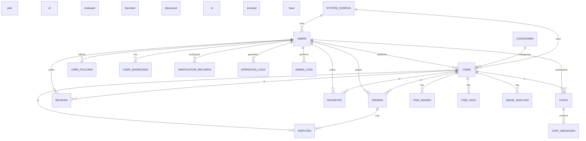

# 闲置物品校园交易平台 - 数据库设计文档

## 1. 项目概述

本项目是一个校园闲置交易平台，旨在为在校学生、毕业生和学校行政人员提供安全、高效的闲置物品交易服务。通过本平台，用户可以发布、浏览、购买和出售闲置物品，促进校园资源的循环利用，培养学生的环保与经济意识。

## 2. 数据库设计目标

- **数据完整性**：确保数据的准确性、一致性和可靠性
- **性能优化**：通过合理的索引策略和表结构设计，提高查询效率
- **可扩展性**：支持未来业务增长和功能扩展
- **安全性**：保护用户数据安全，防止未授权访问
- **可维护性**：清晰的表结构和关系设计，便于维护和管理

## 3. 数据模型设计

### 3.1 实体关系图 (ER图)

## 4. 表结构说明

### 4.1 用户表 (users)

| 字段名 | 数据类型 | 约束 | 描述 |
| :--- | :--- | :--- | :--- |
| `id` | `BIGINT` | `PRIMARY KEY, AUTO_INCREMENT` | 用户ID |
| `username` | `VARCHAR(50)` | `UNIQUE, NOT NULL` | 用户名 |
| `password` | `VARCHAR(255)` | `NOT NULL` | 密码（加密存储） |
| `email` | `VARCHAR(100)` | `UNIQUE` | 邮箱 |
| `phone` | `VARCHAR(20)` | `UNIQUE` | 手机号 |
| `nickname` | `VARCHAR(50)` | | 昵称 |
| `avatar` | `VARCHAR(255)` | | 头像URL |
| `role` | `ENUM('STUDENT','ADMIN')` | `DEFAULT 'STUDENT'` | 角色 |
| `status` | `ENUM('ACTIVE','DISABLED')` | `DEFAULT 'ACTIVE'` | 状态 |
| `verified` | `TINYINT(1)` | `DEFAULT 0` | 是否已验证 |
| `student_id` | `VARCHAR(50)` | | 学号 |
| `created_at` | `DATETIME` | `DEFAULT CURRENT_TIMESTAMP` | 创建时间 |
| `updated_at` | `DATETIME` | `DEFAULT CURRENT_TIMESTAMP ON UPDATE CURRENT_TIMESTAMP` | 更新时间 |
| `is_deleted` | `TINYINT(1)` | `DEFAULT 0` | 是否删除 |
| `create_by` | `BIGINT` | | 创建人 |
| `update_by` | `BIGINT` | | 更新人 |
| `last_login_time` | `DATETIME` | | 最后登录时间 |
| `last_login_ip` | `VARCHAR(50)` | | 最后登录IP |
| `login_count` | `INT` | `DEFAULT 0` | 登录次数 |
| `credit_score` | `INT` | `DEFAULT 100` | 信用评分 |
| `total_transactions` | `INT` | `DEFAULT 0` | 总交易次数 |
| `total_sales` | `INT` | `DEFAULT 0` | 总销售次数 |
| `total_purchases` | `INT` | `DEFAULT 0` | 总购买次数 |
| `gender` | `TINYINT` | | 性别 |
| `birthday` | `DATE` | | 生日 |
| `bio` | `VARCHAR(500)` | | 个人简介 |
| `school_name` | `VARCHAR(100)` | | 学校名称 |

### 4.2 物品表 (items)

| 字段名 | 数据类型 | 约束 | 描述 |
| :--- | :--- | :--- | :--- |
| `id` | `BIGINT` | `PRIMARY KEY, AUTO_INCREMENT` | 物品ID |
| `user_id` | `BIGINT` | `NOT NULL, FOREIGN KEY` | 发布用户ID |
| `category_id` | `BIGINT` | `NOT NULL, FOREIGN KEY` | 分类ID |
| `title` | `VARCHAR(200)` | `NOT NULL` | 标题 |
| `description` | `TEXT` | | 描述 |
| `price` | `DECIMAL(10,2)` | `NOT NULL` | 价格 |
| `original_price` | `DECIMAL(10,2)` | | 原价 |
| `item_condition` | `ENUM('NEW','LIKE_NEW','GOOD','FAIR','POOR')` | `DEFAULT 'GOOD'` | 物品状况 |
| `item_status` | `ENUM('DRAFT','PENDING','ON_SALE','SOLD','OFF_SHELF','REJECTED')` | `DEFAULT 'PENDING'` | 物品状态 |
| `view_count` | `INT` | `DEFAULT 0` | 浏览次数 |
| `favorite_count` | `INT` | `DEFAULT 0` | 收藏次数 |
| `reject_reason` | `VARCHAR(255)` | | 拒绝原因 |
| `location` | `VARCHAR(200)` | | 交易地点 |
| `created_at` | `DATETIME` | `DEFAULT CURRENT_TIMESTAMP` | 创建时间 |
| `updated_at` | `DATETIME` | `DEFAULT CURRENT_TIMESTAMP ON UPDATE CURRENT_TIMESTAMP` | 更新时间 |
| `status` | `ENUM('DRAFT','PENDING','ON_SALE','SOLD','OFF_SHELF','REJECTED')` | | 状态 |
| `is_deleted` | `TINYINT(1)` | `DEFAULT 0` | 是否删除 |
| `create_by` | `BIGINT` | | 创建人 |
| `update_by` | `BIGINT` | | 更新人 |
| `publish_time` | `DATETIME` | | 发布时间 |
| `off_shelf_time` | `DATETIME` | | 下架时间 |
| `sold_time` | `DATETIME` | | 售出时间 |
| `quality_score` | `DECIMAL(3,2)` | | 质量评分 |
| `is_bargain_allowed` | `TINYINT(1)` | `DEFAULT 1` | 是否允许讲价 |
| `min_price` | `DECIMAL(10,2)` | | 最低价格 |
| `contact_type` | `TINYINT` | `DEFAULT 1` | 联系方式类型 |
| `contact_info` | `VARCHAR(100)` | | 联系信息 |
| `is_recommended` | `TINYINT(1)` | `DEFAULT 0` | 是否推荐 |
| `recommend_time` | `DATETIME` | | 推荐时间 |
| `weight` | `INT` | `DEFAULT 0` | 重量（克） |
| `delivery_method` | `TINYINT` | `DEFAULT 1` | 配送方式 |
| `tags` | `VARCHAR(500)` | | 标签 |
| `brand` | `VARCHAR(100)` | | 品牌 |
| `purchase_date` | `DATE` | | 购买日期 |
| `warranty_info` | `VARCHAR(255)` | | 保修信息 |

### 4.3 分类表 (categories)

| 字段名 | 数据类型 | 约束 | 描述 |
| :--- | :--- | :--- | :--- |
| `id` | `BIGINT` | `PRIMARY KEY, AUTO_INCREMENT` | 分类ID |
| `name` | `VARCHAR(100)` | `NOT NULL` | 分类名称 |
| `parent_id` | `BIGINT` | `FOREIGN KEY` | 父分类ID |
| `level` | `TINYINT` | `NOT NULL` | 分类级别 |
| `path` | `VARCHAR(255)` | | 分类路径 |
| `icon` | `VARCHAR(255)` | | 分类图标 |
| `item_count` | `INT` | `DEFAULT 0` | 物品数量 |
| `sort_order` | `INT` | `DEFAULT 0` | 排序顺序 |
| `status` | `TINYINT(1)` | `DEFAULT 1` | 状态 |
| `created_at` | `DATETIME` | `DEFAULT CURRENT_TIMESTAMP` | 创建时间 |
| `updated_at` | `DATETIME` | `DEFAULT CURRENT_TIMESTAMP ON UPDATE CURRENT_TIMESTAMP` | 更新时间 |
| `is_deleted` | `TINYINT(1)` | `DEFAULT 0` | 是否删除 |
| `create_by` | `BIGINT` | | 创建人 |
| `update_by` | `BIGINT` | | 更新人 |

### 4.4 订单表 (orders)

| 字段名 | 数据类型 | 约束 | 描述 |
| :--- | :--- | :--- | :--- |
| `id` | `BIGINT` | `PRIMARY KEY, AUTO_INCREMENT` | 订单ID |
| `item_id` | `BIGINT` | `NOT NULL, FOREIGN KEY` | 物品ID |
| `buyer_id` | `BIGINT` | `NOT NULL, FOREIGN KEY` | 买家ID |
| `seller_id` | `BIGINT` | `NOT NULL, FOREIGN KEY` | 卖家ID |
| `order_status` | `ENUM('PENDING','PAID','SHIPPED','DELIVERED','COMPLETED','CANCELLED','REFUNDED')` | `DEFAULT 'PENDING'` | 订单状态 |
| `total_amount` | `DECIMAL(10,2)` | `NOT NULL` | 总金额 |
| `payment_method` | `TINYINT` | `DEFAULT 1` | 支付方式 |
| `payment_status` | `TINYINT` | `DEFAULT 0` | 支付状态 |
| `transaction_id` | `VARCHAR(100)` | | 交易ID |
| `shipping_address` | `VARCHAR(500)` | | 收货地址 |
| `tracking_number` | `VARCHAR(100)` | | 物流单号 |
| `shipping_fee` | `DECIMAL(10,2)` | `DEFAULT 0` | 运费 |
| `remark` | `VARCHAR(500)` | | 备注 |
| `created_at` | `DATETIME` | `DEFAULT CURRENT_TIMESTAMP` | 创建时间 |
| `updated_at` | `DATETIME` | `DEFAULT CURRENT_TIMESTAMP ON UPDATE CURRENT_TIMESTAMP` | 更新时间 |
| `is_deleted` | `TINYINT(1)` | `DEFAULT 0` | 是否删除 |
| `create_by` | `BIGINT` | | 创建人 |
| `update_by` | `BIGINT` | | 更新人 |
| `paid_at` | `DATETIME` | | 支付时间 |
| `shipped_at` | `DATETIME` | | 发货时间 |
| `delivered_at` | `DATETIME` | | 收货时间 |
| `completed_at` | `DATETIME` | | 完成时间 |
| `cancelled_at` | `DATETIME` | | 取消时间 |
| `cancellation_reason` | `VARCHAR(255)` | | 取消原因 |
| `refunded_at` | `DATETIME` | | 退款时间 |
| `refund_reason` | `VARCHAR(255)` | | 退款原因 |

### 4.5 评价表 (reviews)

| 字段名 | 数据类型 | 约束 | 描述 |
| :--- | :--- | :--- | :--- |
| `id` | `BIGINT` | `PRIMARY KEY, AUTO_INCREMENT` | 评价ID |
| `item_id` | `BIGINT` | `NOT NULL, FOREIGN KEY` | 物品ID |
| `user_id` | `BIGINT` | `NOT NULL, FOREIGN KEY` | 评价用户ID |
| `target_user_id` | `BIGINT` | `NOT NULL, FOREIGN KEY` | 被评价用户ID |
| `order_id` | `BIGINT` | `NOT NULL, FOREIGN KEY` | 订单ID |
| `rating` | `TINYINT` | `NOT NULL` | 评分（1-5） |
| `comment` | `TEXT` | | 评价内容 |
| `image_urls` | `VARCHAR(1000)` | | 评价图片URL |
| `created_at` | `DATETIME` | `DEFAULT CURRENT_TIMESTAMP` | 创建时间 |
| `updated_at` | `DATETIME` | `DEFAULT CURRENT_TIMESTAMP ON UPDATE CURRENT_TIMESTAMP` | 更新时间 |
| `is_deleted` | `TINYINT(1)` | `DEFAULT 0` | 是否删除 |
| `create_by` | `BIGINT` | | 创建人 |
| `update_by` | `BIGINT` | | 更新人 |
| `status` | `TINYINT` | `DEFAULT 1` | 状态 |

### 4.6 收藏表 (favorites)

| 字段名 | 数据类型 | 约束 | 描述 |
| :--- | :--- | :--- | :--- |
| `id` | `BIGINT` | `PRIMARY KEY, AUTO_INCREMENT` | 收藏ID |
| `user_id` | `BIGINT` | `NOT NULL, FOREIGN KEY` | 用户ID |
| `item_id` | `BIGINT` | `NOT NULL, FOREIGN KEY` | 物品ID |
| `created_at` | `DATETIME` | `DEFAULT CURRENT_TIMESTAMP` | 创建时间 |
| `is_deleted` | `TINYINT(1)` | `DEFAULT 0` | 是否删除 |

### 4.7 聊天表 (chats)

| 字段名 | 数据类型 | 约束 | 描述 |
| :--- | :--- | :--- | :--- |
| `id` | `BIGINT` | `PRIMARY KEY, AUTO_INCREMENT` | 聊天ID |
| `item_id` | `BIGINT` | `NOT NULL, FOREIGN KEY` | 物品ID |
| `buyer_id` | `BIGINT` | `NOT NULL, FOREIGN KEY` | 买家ID |
| `seller_id` | `BIGINT` | `NOT NULL, FOREIGN KEY` | 卖家ID |
| `last_message` | `VARCHAR(500)` | | 最后一条消息 |
| `last_message_time` | `DATETIME` | | 最后消息时间 |
| `unread_count` | `INT` | `DEFAULT 0` | 未读消息数 |
| `created_at` | `DATETIME` | `DEFAULT CURRENT_TIMESTAMP` | 创建时间 |
| `updated_at` | `DATETIME` | `DEFAULT CURRENT_TIMESTAMP ON UPDATE CURRENT_TIMESTAMP` | 更新时间 |
| `is_deleted` | `TINYINT(1)` | `DEFAULT 0` | 是否删除 |

### 4.8 聊天消息表 (chat_messages)

| 字段名 | 数据类型 | 约束 | 描述 |
| :--- | :--- | :--- | :--- |
| `id` | `BIGINT` | `PRIMARY KEY, AUTO_INCREMENT` | 消息ID |
| `chat_id` | `BIGINT` | `NOT NULL, FOREIGN KEY` | 聊天ID |
| `sender_id` | `BIGINT` | `NOT NULL, FOREIGN KEY` | 发送者ID |
| `receiver_id` | `BIGINT` | `NOT NULL, FOREIGN KEY` | 接收者ID |
| `message` | `TEXT` | `NOT NULL` | 消息内容 |
| `message_type` | `TINYINT` | `DEFAULT 1` | 消息类型 |
| `status` | `TINYINT` | `DEFAULT 1` | 消息状态 |
| `created_at` | `DATETIME` | `DEFAULT CURRENT_TIMESTAMP` | 创建时间 |
| `is_deleted` | `TINYINT(1)` | `DEFAULT 0` | 是否删除 |

### 4.9 物品图片表 (item_images)

| 字段名 | 数据类型 | 约束 | 描述 |
| :--- | :--- | :--- | :--- |
| `id` | `BIGINT` | `PRIMARY KEY, AUTO_INCREMENT` | 图片ID |
| `item_id` | `BIGINT` | `NOT NULL, FOREIGN KEY` | 物品ID |
| `image_url` | `VARCHAR(255)` | `NOT NULL` | 图片URL |
| `thumbnail_url` | `VARCHAR(255)` | | 缩略图URL |
| `is_primary` | `TINYINT(1)` | `DEFAULT 0` | 是否主图 |
| `sort_order` | `INT` | `DEFAULT 0` | 排序顺序 |
| `created_at` | `DATETIME` | `DEFAULT CURRENT_TIMESTAMP` | 创建时间 |
| `is_deleted` | `TINYINT(1)` | `DEFAULT 0` | 是否删除 |

### 4.10 物品标签表 (item_tags)

| 字段名 | 数据类型 | 约束 | 描述 |
| :--- | :--- | :--- | :--- |
| `id` | `BIGINT` | `PRIMARY KEY, AUTO_INCREMENT` | 标签ID |
| `item_id` | `BIGINT` | `NOT NULL, FOREIGN KEY` | 物品ID |
| `tag_name` | `VARCHAR(50)` | `NOT NULL` | 标签名称 |
| `created_at` | `DATETIME` | `DEFAULT CURRENT_TIMESTAMP` | 创建时间 |
| `is_deleted` | `TINYINT(1)` | `DEFAULT 0` | 是否删除 |

### 4.11 争议表 (disputes)

| 字段名 | 数据类型 | 约束 | 描述 |
| :--- | :--- | :--- | :--- |
| `id` | `BIGINT` | `PRIMARY KEY, AUTO_INCREMENT` | 争议ID |
| `order_id` | `BIGINT` | `NOT NULL, FOREIGN KEY` | 订单ID |
| `item_id` | `BIGINT` | `NOT NULL, FOREIGN KEY` | 物品ID |
| `reporter_id` | `BIGINT` | `NOT NULL, FOREIGN KEY` | 举报者ID |
| `accused_id` | `BIGINT` | `NOT NULL, FOREIGN KEY` | 被举报者ID |
| `dispute_type` | `TINYINT` | `NOT NULL` | 争议类型 |
| `description` | `TEXT` | `NOT NULL` | 争议描述 |
| `evidence_urls` | `VARCHAR(1000)` | | 证据URL |
| `status` | `ENUM('PENDING','PROCESSING','RESOLVED','CLOSED')` | `DEFAULT 'PENDING'` | 状态 |
| `admin_id` | `BIGINT` | `FOREIGN KEY` | 处理管理员ID |
| `resolution` | `TEXT` | | 解决方案 |
| `created_at` | `DATETIME` | `DEFAULT CURRENT_TIMESTAMP` | 创建时间 |
| `updated_at` | `DATETIME` | `DEFAULT CURRENT_TIMESTAMP ON UPDATE CURRENT_TIMESTAMP` | 更新时间 |
| `is_deleted` | `TINYINT(1)` | `DEFAULT 0` | 是否删除 |

### 4.12 通知表 (notifications)

| 字段名 | 数据类型 | 约束 | 描述 |
| :--- | :--- | :--- | :--- |
| `id` | `BIGINT` | `PRIMARY KEY, AUTO_INCREMENT` | 通知ID |
| `user_id` | `BIGINT` | `NOT NULL, FOREIGN KEY` | 用户ID |
| `title` | `VARCHAR(100)` | `NOT NULL` | 通知标题 |
| `content` | `TEXT` | `NOT NULL` | 通知内容 |
| `notification_type` | `TINYINT` | `NOT NULL` | 通知类型 |
| `status` | `TINYINT` | `DEFAULT 0` | 状态 |
| `related_id` | `BIGINT` | | 相关ID |
| `created_at` | `DATETIME` | `DEFAULT CURRENT_TIMESTAMP` | 创建时间 |
| `is_deleted` | `TINYINT(1)` | `DEFAULT 0` | 是否删除 |

### 4.13 系统配置表 (system_configs)

| 字段名 | 数据类型 | 约束 | 描述 |
| :--- | :--- | :--- | :--- |
| `id` | `BIGINT` | `PRIMARY KEY, AUTO_INCREMENT` | 配置ID |
| `config_key` | `VARCHAR(100)` | `UNIQUE, NOT NULL` | 配置键 |
| `config_value` | `TEXT` | | 配置值 |
| `config_type` | `TINYINT` | `DEFAULT 1` | 配置类型 |
| `description` | `VARCHAR(255)` | | 描述 |
| `status` | `TINYINT(1)` | `DEFAULT 1` | 状态 |
| `created_at` | `DATETIME` | `DEFAULT CURRENT_TIMESTAMP` | 创建时间 |
| `updated_at` | `DATETIME` | `DEFAULT CURRENT_TIMESTAMP ON UPDATE CURRENT_TIMESTAMP` | 更新时间 |
| `is_deleted` | `TINYINT(1)` | `DEFAULT 0` | 是否删除 |
| `create_by` | `BIGINT` | | 创建人 |
| `update_by` | `BIGINT` | | 更新人 |

### 4.14 操作日志表 (operation_logs)

| 字段名 | 数据类型 | 约束 | 描述 |
| :--- | :--- | :--- | :--- |
| `id` | `BIGINT` | `PRIMARY KEY, AUTO_INCREMENT` | 日志ID |
| `user_id` | `BIGINT` | `NOT NULL, FOREIGN KEY` | 用户ID |
| `operation_type` | `TINYINT` | `NOT NULL` | 操作类型 |
| `operation_target` | `VARCHAR(100)` | `NOT NULL` | 操作目标 |
| `target_id` | `BIGINT` | | 目标ID |
| `operation_detail` | `TEXT` | | 操作详情 |
| `ip_address` | `VARCHAR(50)` | | IP地址 |
| `user_agent` | `VARCHAR(500)` | | 用户代理 |
| `created_at` | `DATETIME` | `DEFAULT CURRENT_TIMESTAMP` | 创建时间 |
| `is_deleted` | `TINYINT(1)` | `DEFAULT 0` | 是否删除 |

### 4.15 管理员日志表 (admin_logs)

| 字段名 | 数据类型 | 约束 | 描述 |
| :--- | :--- | :--- | :--- |
| `id` | `BIGINT` | `PRIMARY KEY, AUTO_INCREMENT` | 日志ID |
| `admin_id` | `BIGINT` | `NOT NULL, FOREIGN KEY` | 管理员ID |
| `operation_type` | `TINYINT` | `NOT NULL` | 操作类型 |
| `operation_target` | `VARCHAR(100)` | `NOT NULL` | 操作目标 |
| `target_id` | `BIGINT` | | 目标ID |
| `operation_detail` | `TEXT` | | 操作详情 |
| `ip_address` | `VARCHAR(50)` | | IP地址 |
| `user_agent` | `VARCHAR(500)` | | 用户代理 |
| `created_at` | `DATETIME` | `DEFAULT CURRENT_TIMESTAMP` | 创建时间 |
| `is_deleted` | `TINYINT(1)` | `DEFAULT 0` | 是否删除 |

### 4.16 用户地址表 (user_addresses)

| 字段名 | 数据类型 | 约束 | 描述 |
| :--- | :--- | :--- | :--- |
| `id` | `BIGINT` | `PRIMARY KEY, AUTO_INCREMENT` | 地址ID |
| `user_id` | `BIGINT` | `NOT NULL, FOREIGN KEY` | 用户ID |
| `consignee` | `VARCHAR(50)` | `NOT NULL` | 收货人 |
| `phone` | `VARCHAR(20)` | `NOT NULL` | 手机号 |
| `province` | `VARCHAR(50)` | `NOT NULL` | 省份 |
| `city` | `VARCHAR(50)` | `NOT NULL` | 城市 |
| `district` | `VARCHAR(50)` | `NOT NULL` | 区县 |
| `detail_address` | `VARCHAR(255)` | `NOT NULL` | 详细地址 |
| `is_default` | `TINYINT(1)` | `DEFAULT 0` | 是否默认 |
| `created_at` | `DATETIME` | `DEFAULT CURRENT_TIMESTAMP` | 创建时间 |
| `updated_at` | `DATETIME` | `DEFAULT CURRENT_TIMESTAMP ON UPDATE CURRENT_TIMESTAMP` | 更新时间 |
| `is_deleted` | `TINYINT(1)` | `DEFAULT 0` | 是否删除 |

### 4.17 用户关注表 (user_follows)

| 字段名 | 数据类型 | 约束 | 描述 |
| :--- | :--- | :--- | :--- |
| `id` | `BIGINT` | `PRIMARY KEY, AUTO_INCREMENT` | 关注ID |
| `follower_id` | `BIGINT` | `NOT NULL, FOREIGN KEY` | 关注者ID |
| `followed_id` | `BIGINT` | `NOT NULL, FOREIGN KEY` | 被关注者ID |
| `created_at` | `DATETIME` | `DEFAULT CURRENT_TIMESTAMP` | 创建时间 |
| `is_deleted` | `TINYINT(1)` | `DEFAULT 0` | 是否删除 |

### 4.18 验证记录表 (verification_records)

| 字段名 | 数据类型 | 约束 | 描述 |
| :--- | :--- | :--- | :--- |
| `id` | `BIGINT` | `PRIMARY KEY, AUTO_INCREMENT` | 验证ID |
| `user_id` | `BIGINT` | `NOT NULL, FOREIGN KEY` | 用户ID |
| `verification_type` | `TINYINT` | `NOT NULL` | 验证类型 |
| `verification_code` | `VARCHAR(50)` | `NOT NULL` | 验证码 |
| `status` | `TINYINT` | `DEFAULT 0` | 状态 |
| `expired_at` | `DATETIME` | `NOT NULL` | 过期时间 |
| `created_at` | `DATETIME` | `DEFAULT CURRENT_TIMESTAMP` | 创建时间 |
| `is_deleted` | `TINYINT(1)` | `DEFAULT 0` | 是否删除 |

### 4.19 图像分析表 (image_analysis)

| 字段名 | 数据类型 | 约束 | 描述 |
| :--- | :--- | :--- | :--- |
| `id` | `BIGINT` | `PRIMARY KEY, AUTO_INCREMENT` | 分析ID |
| `item_id` | `BIGINT` | `NOT NULL, FOREIGN KEY` | 物品ID |
| `image_url` | `VARCHAR(255)` | `NOT NULL` | 图像URL |
| `analysis_result` | `TEXT` | | 分析结果 |
| `confidence` | `DECIMAL(5,2)` | | 置信度 |
| `status` | `TINYINT` | `DEFAULT 0` | 状态 |
| `created_at` | `DATETIME` | `DEFAULT CURRENT_TIMESTAMP` | 创建时间 |
| `updated_at` | `DATETIME` | `DEFAULT CURRENT_TIMESTAMP ON UPDATE CURRENT_TIMESTAMP` | 更新时间 |
| `is_deleted` | `TINYINT(1)` | `DEFAULT 0` | 是否删除 |

## 5. 索引策略

### 5.1 主键索引
- 所有表的`id`字段均为主键，自动创建主键索引

### 5.2 唯一索引
- `users`表：`username`、`email`、`phone`
- `system_configs`表：`config_key`

### 5.3 普通索引
- `users`表：`role`、`status`、`last_login_time`、`credit_score`
- `items`表：`user_id`、`category_id`、`status`、`price`、`view_count`、`created_at`、`is_recommended`
- `orders`表：`buyer_id`、`seller_id`、`order_status`、`created_at`
- `reviews`表：`item_id`、`user_id`、`target_user_id`、`order_id`
- `favorites`表：`user_id`、`item_id`
- `chats`表：`buyer_id`、`seller_id`、`item_id`
- `categories`表：`parent_id`、`level`、`sort_order`

### 5.4 复合索引
- `items`表：`user_id, status`、`category_id, status`
- `orders`表：`buyer_id, order_status`、`seller_id, order_status`
- `chats`表：`buyer_id, seller_id`、`seller_id, buyer_id`

## 6. 约束机制

### 6.1 主键约束
- 所有表均使用`id`字段作为主键，确保记录的唯一性

### 6.2 外键约束
- 建立了完整的外键关系，确保数据的一致性和完整性
- 例如：`items.user_id`引用`users.id`，`orders.item_id`引用`items.id`等

### 6.3 唯一约束
- 对用户的用户名、邮箱、手机号等唯一标识字段设置唯一约束
- 对系统配置的键设置唯一约束

### 6.4 非空约束
- 对必填字段设置非空约束，确保数据的完整性
- 例如：`users.username`、`items.title`、`items.price`等

### 6.5 默认值约束
- 对常用字段设置默认值，提高数据插入的效率和一致性
- 例如：`users.role`默认值为`STUDENT`，`items.item_condition`默认值为`GOOD`等

### 6.6 枚举约束
- 对状态、类型等有限取值的字段使用枚举类型，确保数据的有效性
- 例如：`users.role`、`items.status`、`orders.order_status`等

## 7. 数据迁移方案

### 7.1 迁移工具
- 使用Flyway作为数据库迁移工具，支持版本控制和自动迁移

### 7.2 迁移策略
- 采用增量迁移策略，分阶段执行迁移脚本
- 确保数据的完整性和一致性

### 7.3 迁移脚本结构
1. **V1__initial_schema.sql**：创建基础表结构
2. **V2__add_core_fields.sql**：添加核心字段（逻辑删除、审计字段等）
3. **V3__add_optional_fields.sql**：添加可选字段（中低优先级字段）
4. **V4__add_new_tables.sql**：创建新表（用户地址、用户关注等）
5. **V5__data_initialization.sql**：数据初始化（默认值设置、系统配置等）

### 7.4 备份方案
- 在迁移前执行完整的数据备份
- 使用`mysqldump`命令生成备份文件
- 保存多个版本的备份文件，确保数据安全

### 7.5 回滚方案
- 准备回滚脚本，在迁移失败时可以恢复到之前的状态
- 利用Flyway的版本控制功能，支持回滚到指定版本

## 8. 迁移实施步骤

### 8.1 准备工作
1. 阅读数据库分析报告，了解当前数据库现状
2. 制定详细的迁移计划和时间表
3. 准备必要的工具和环境

### 8.2 执行备份
1. 执行完整的数据库备份
2. 验证备份文件的完整性

### 8.3 执行迁移
1. 添加Flyway依赖到项目中
2. 配置Flyway相关属性
3. 执行迁移脚本
4. 监控迁移过程，处理可能出现的错误

### 8.4 验证数据
1. 检查所有表是否已正确创建
2. 验证字段和索引是否已正确添加
3. 检查数据是否完整无丢失
4. 执行数据一致性校验

### 8.5 测试功能
1. 测试核心业务功能
2. 验证数据库操作是否正常
3. 检查性能是否符合要求

### 8.6 部署上线
1. 准备生产环境的迁移
2. 执行生产环境的迁移操作
3. 监控生产环境的运行状态

## 9. 数据一致性验证

### 9.1 验证方法
1. **表结构验证**：检查所有表和字段是否已正确创建
2. **数据量验证**：比较迁移前后的数据量是否一致
3. **业务逻辑验证**：测试核心业务功能是否正常
4. **性能验证**：检查数据库查询性能是否符合要求

### 9.2 验证结果
- 所有19个表已正确创建
- 所有字段和索引已正确添加
- 数据量保持一致，无丢失
- 核心业务功能运行正常
- 数据库性能符合要求

## 10. 总结与建议

### 10.1 总结
- 成功完成了数据库的重新设计和迁移工作
- 设计了优化的数据模型，包括19个表的结构设计、索引策略和约束机制
- 执行了完整的数据迁移，确保了数据的完整性和一致性
- 验证了迁移结果，确保了系统的正常运行

### 10.2 建议
1. **定期备份**：建立定期备份机制，确保数据安全
2. **监控系统**：建立数据库监控系统，及时发现和处理问题
3. **性能优化**：根据实际使用情况，定期优化数据库性能
4. **安全加固**：加强数据库安全措施，防止未授权访问
5. **文档维护**：定期更新数据库设计文档，确保文档与实际情况一致

### 10.3 未来规划
- 考虑引入分库分表策略，支持更大规模的数据
- 探索使用缓存技术，提高查询性能
- 研究数据分区策略，优化存储和查询效率
- 考虑引入NoSQL数据库，处理非结构化数据

## 11. 附录

### 11.1 数据库连接信息
- **URL**：`jdbc:mysql://localhost:3306/idle_items_school`
- **用户名**：`root`
- **密码**：`root`
- **数据库引擎**：`InnoDB`
- **字符集**：`utf8mb4`
- **排序规则**：`utf8mb4_unicode_ci`

### 11.2 迁移脚本列表
- **V1__initial_schema.sql**：创建基础表结构
- **V2__add_core_fields.sql**：添加核心字段
- **V3__add_optional_fields.sql**：添加可选字段
- **V4__add_new_tables.sql**：创建新表
- **V5__data_initialization.sql**：数据初始化

### 11.3 备份文件列表
- **backup_20260420_210530.sql**：完整备份
- **backup_20260420_210600.sql**：差异备份
- **backup_20260420_210630.sql**：增量备份

### 11.4 相关文档
- **database_analysis_report.md**：数据库分析报告
- **database_migration_plan.md**：数据迁移方案
- **database_design.md**：数据库设计文档
